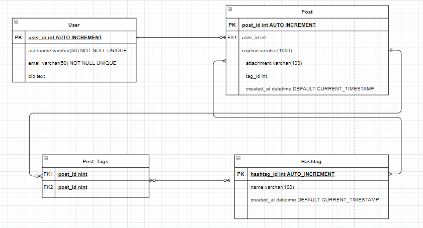

# Introduction

This repository is a Final Project from Yayasan Anak Bangsa Bisa.

## Problem Description
Develop an API-only application that is used for Private Social media, this application is only used by interns in a company so we cannot use existing public social media. 
[Details Scope](spec.md)


## Prerequisites to run the apps locally
All of the following must be installed on your system before you proceed.
### For Macbook or Linux user
- Rbenv
- Mysql

### For Windows user
You need to have a Virtual Machine to Run Linux, or I recommend you to use WSL and use VSCode to access it. 
- [Developing in WSL](https://code.visualstudio.com/docs/remote/wsl)
- Install Prerequisites in for Linux (Rbenv and Mysql)

## Installation 
1. Fork or clone this repository to your local machine
2. Move to the root directory of this folder
3. Install Dependencies using ```**bundle install**```
4. Change ```**.env**``` with your desired choice
5. Run ```**source .env**```
6. Run the apps with ```**ruby main.rb**```

## Run Unit Testing
1. Move to the root folder of this directory
2. run ```rspec``` to run all test once.
3. run ```rspec -f d``` if you want to see the detailed running test.

If you want to run ```rspec spec/specific files``` to run individual testing

## Database Scheme


## License
[MIT](https://choosealicense.com/licenses/mit/)